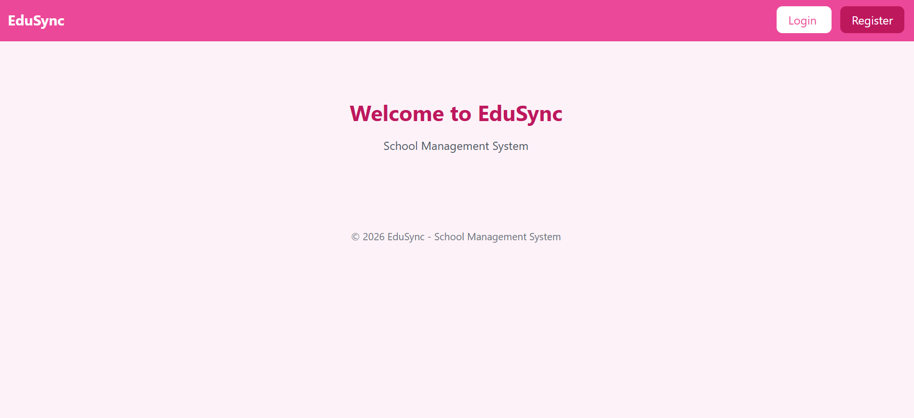
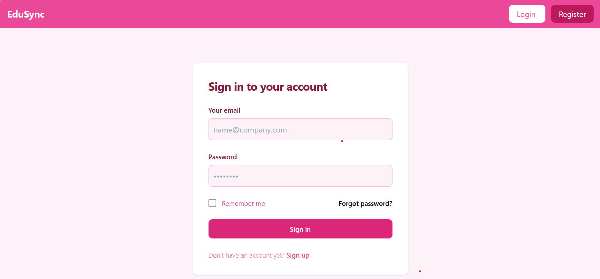
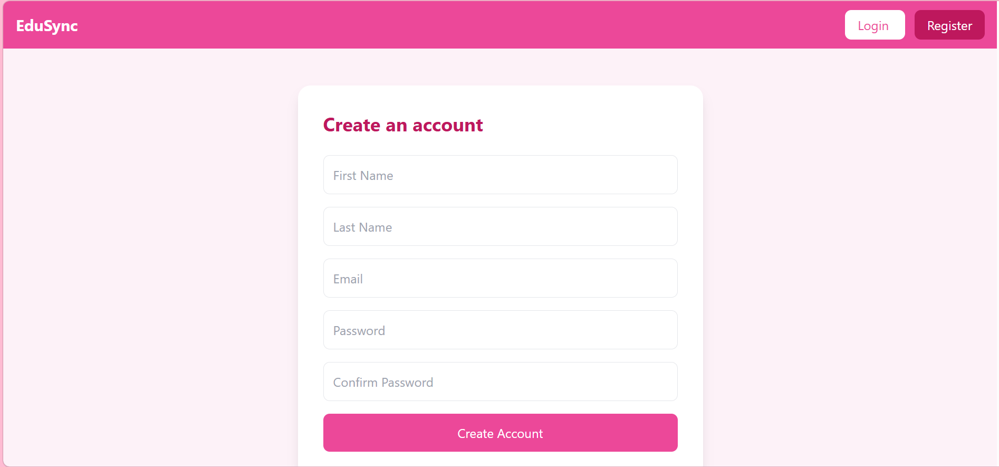
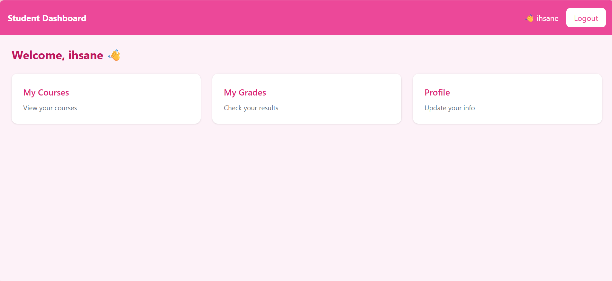

# 🎓 EduSync - School Management System

EduSync est une application web de gestion scolaire développée en PHP.
Elle permet de gérer l'inscription, la connexion des utilisateurs et l'accès sécurisé au dashboard.

---

## 📸 Aperçu du projet

### 🏠 Home Page

### 🔐 Login Page

### 📝 Register Page

### 📊 Dashboard

---

## 🚀 Fonctionnalités

* 🔐 Inscription des utilisateurs (Register)
* 🔑 Authentification sécurisée (Login)
* 🧠 Gestion des sessions
* 🚫 Protection des pages (accès autorisé uniquement)
* 🧼 Validation et nettoyage des données (XSS Protection)
* 🎨 Interface moderne avec Tailwind CSS
* 👤 Dashboard personnalisé (affichage du nom de l'utilisateur)
* 🚪 Déconnexion (Logout)

---

## 🏗️ Structure du projet

School_mangement/
│
├── auth/
│   ├── login.php
│   ├── login_process.php
│   ├── register.php
│   ├── register_process.php
│   └── logout.php
│
├── config/
│   └── db.php
│
├── dashboard/
│   └── index.php
│
├── includes/
│   ├── header.php
│   └── footer.php
│
├── index.php
└── README.md

---

## ⚙️ Technologies utilisées

* PHP (Backend)
* MySQL (Base de données)
* Tailwind CSS (Frontend)
* XAMPP (Environnement local)

---

## 🔐 Sécurité

* Validation des champs (champs obligatoires, format email)
* Hashage des mots de passe avec password_hash()
* Vérification avec password_verify()
* Protection contre les attaques XSS avec htmlspecialchars() et strip_tags()
* Sessions pour sécuriser l'accès aux pages

---

## 🧑‍💻 Installation

1. Cloner le projet :
   git clone https://github.com/your-username/edusync.git

2. Placer le dossier dans htdocs (XAMPP)

3. Démarrer Apache et MySQL

4. Créer une base de données (ex: school_management)

5. Configurer la connexion dans :
   config/db.php

6. Accéder au projet :
   http://localhost/School_mangement

---

## 📌 Améliorations futures

* 👨‍🏫 Gestion des rôles (Admin / Student)
* 📚 Gestion des cours
* 📊 Dashboard dynamique avec statistiques
* 📝 Modification du profil utilisateur
* 📱 Responsive design avancé

---

## 👨‍🎓 Auteur

Projet réalisé par : **IHSANE BEN-MOUINA**

---

## 📄 Licence

Ce projet est open-source et libre d’utilisation.
